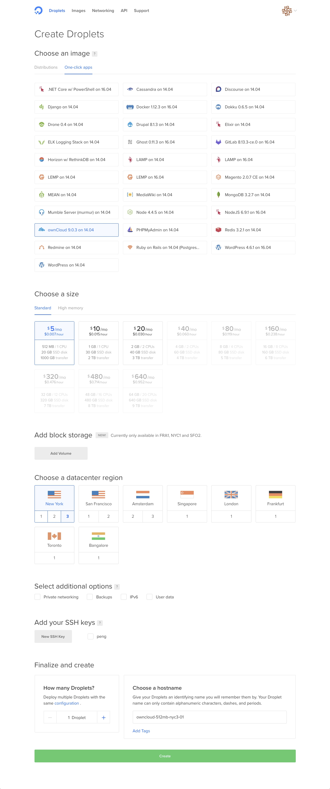

title: 快速搭建私有云
date: 2016-11-20 12:04:38
tags: 
- 私有云
---

快速搭建私有云
<!--more-->
#工具
1. vps digitalocean.com
原因 ： 最快，可以一键创建 ownCloud。
也可以自己一步步搭建。但是比较麻烦。
2. paypal 账号。便于vps服务。
因为大部分支持支付宝，银联的vps需要域名备案。不需要备案的不支持支付宝，银联。但是paypal可以用。
3. ownCloud
4. 域名。
 可要可不要。域名与服务器的绑定就不介绍了。
# 步骤
1. digitalocean.com 创建账号，充值。
2. create Droplet
3. 选择 服务器类型，如下图。

4. 等待处理。正常如下图。

5. 完成。
ssh 进去服务器， 查看 ownCloud管理员账号密码。
# 总结
私有云搭建的利弊。
优：
文件可控。自己随意存储自己想放到东西。
缺：
金钱成本
一年400左右。这确实是一个不小的开支。
如果你感觉你的资料值得这个投入。可以自己搭建。如果感觉不值得。可以选择公有云，例如。百度云盘、微云。

